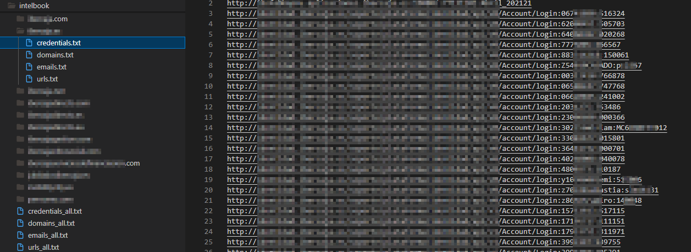

# IntelX Phonebook CLI

Python CLI tool to query **IntelX Phonebook** and extract:

- Email addresses
- Domains
- URLs
- Credentials (credential-bearing URL selectors preserved separately)

It supports a single **query** or a file containing multiple queries, writes per-query outputs, and also produces merged output files in the root output folder.

## Documentation references

- Official IntelX API docs: https://help.intelx.io/docs/api/
- API PDF manual: https://www.ginseg.com/wp-content/uploads/sites/2/2019/07/Manual-Intelligence-X-API.pdf

## Requirements: Paid account for Phonebook

**Phonebook API access requires a paid IntelX account.**

> [!IMPORTANT]
> This tool was developed and tested using a **paid IntelX account**.  
> To run Phonebook queries you need:
> - An **API key**, obtainable from: https://intelx.io/account?tab=developer  
> - The paid API base URL: `https://2.intelx.io`

## Why this exists

IntelX Phonebook is designed to return selectors (emails/domains/URLs) associated with a given selector term (commonly a domain). The recommended flow is:

1. Start a phonebook job: `POST /phonebook/search`
2. Poll results: `GET /phonebook/search/result` until completion

IntelX requires:
- Authentication via API key (recommended via the `x-key` header)
- A valid `User-Agent` identifying your application
- Respecting rate limits (default guidance is **no more than 1 request per second** unless your license states otherwise)

## Installation

```bash
python -m venv .venv
# Windows:
# .venv\Scripts\activate
# Linux/macOS:
source .venv/bin/activate

pip install -r requirements.txt
````

## Usage

### Single query (default: emails + domains + urls + credentials)

```bash
python intelbook.py --api-key YOUR_INTELX_KEY --query example.com
```

> [!NOTE]
> **Credential-bearing URL selectors**
>
> In some IntelX Phonebook responses, URL selectors may include **appended sensitive data**. It is not always `username:password`; it can also be **cookies**, **tokens**, or **session IDs**. 
>
> To keep the URL list clean without losing that data, when `urls` is included in `--types`:
>
> - `urls*.txt` contains the **sanitized base URL** (with appended credentials/tokens removed).
> - `credentials*.txt` contains the **original raw entry** exactly as returned by Phonebook (with appended credentials/tokens).

### Only emails and urls

```bash
python intelbook.py --api-key YOUR_INTELX_KEY --query example.com --types emails,urls
```

### Multiple queries from file

Create `queries.txt`:

```txt
example.com
example.org
# comments are allowed
sub.example.net
*.example.com
user@example.org
```

Run:

```bash
python intelbook.py --api-key YOUR_INTELX_KEY --query queries.txt --types emails,domains,urls
```

### Environment variable (optional)

```bash
export INTELX_API_KEY="YOUR_INTELX_KEY"
python intelbook.py --query example.com
```

## Output structure

By default, the tool writes into `./output`:

```
output/
  <query-folder>/
    emails.txt          (optional, cumulative)
    domains.txt         (optional, cumulative)
    urls.txt            (optional, cumulative)
    credentials.txt     (optional, cumulative; URLs with credentials/tokens)

  <another-query-folder>/
    ...

  emails_all.txt        (optional, cumulative merged)
  domains_all.txt       (optional, cumulative merged)
  urls_all.txt          (optional, cumulative merged)
  credentials_all.txt   (optional, cumulative merged)
```

* Each per-query folder represents the exact query used. If the query is already filesystem-safe, the folder name is the query itself (e.g., example.com, user@example.org). If the query contains characters that are unsafe for folder names (e.g., *, ?, :, /), the tool creates a readable slug and appends a short deterministic hash suffix.
* The `*_all.txt` files are deduplicated merges across all processed domains.

## Operational notes

* `--rps` controls the maximum request rate (defaults to 1.0 req/s).
* `--result-limit` controls how many records are requested per polling call.
* `--maxresults` is the phonebook “maxresults” parameter (default 10000).
* `--json-debug` can be enabled to store raw JSON records per query under each domain folder.

## Exit codes

* `0`: Success
* `2`: Invalid CLI usage or missing inputs
* Non-zero runtime exceptions may also occur if the API returns errors (e.g., 401 unauthorized, 402 credits exhausted).

## Screenshots

### Results example


